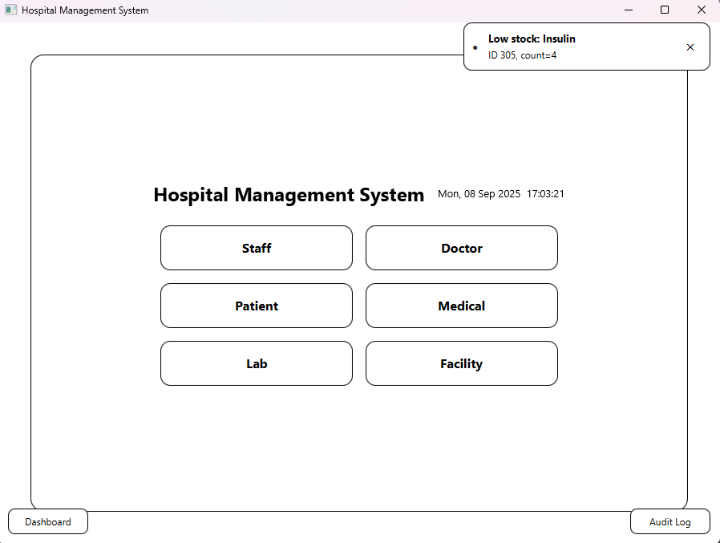
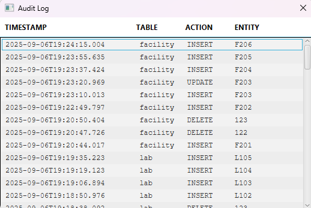
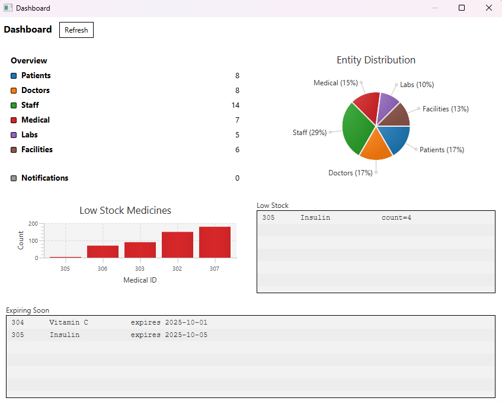
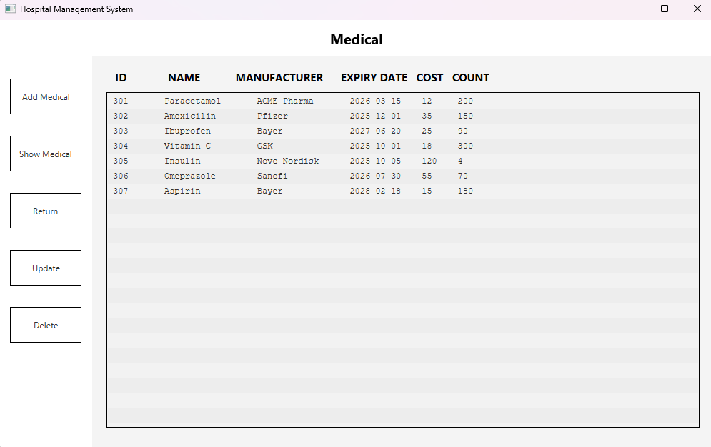

# 🏥 Hospital Management System (HMSImproved)

A **JavaFX-based Hospital Management System** built with **Java 22** and **SQLite**, designed to provide an intuitive interface for managing hospital operations such as **Staff, Doctors, Patients, Medical Inventory, Laboratories, and Facilities**.  
The system follows a **repository pattern** with CRUD operations and includes **audit logging** and a **real-time dashboard**.

## ✨ Features
- 👨‍⚕️ **Staff, Patient, Doctor, Medical, Lab & Facility Management**  
  CRUD operations (Add, Show, Update, Delete) for all core hospital entities.
- 📊 **Dashboard Overview**  
  Displays entity counts, distribution pie charts, low stock alerts, and expiry notifications.
- 📝 **Audit Logging**  
  Tracks every database change (INSERT, UPDATE, DELETE) with timestamped records.
- ⚡ **Low-Stock & Expire Alerts for Medicine Entity**  
  Real-time medicine notifications (e.g., Insulin stock and expire warning).
- 🎨 **Minimalist Black & White UI**  
  Clean interface for easy navigation and professional appearance.
- 💾 **SQLite Integration**  
  Repository pattern with SQL-based persistence.

## 📸 Screenshots & Workflow

### 🏠 Main Dashboard
<p align="center">
  
</p>
The central hub showing all available modules (Staff, Doctor, Patient, Medical, Lab, Facility). Notifications appear here for low stock medicines.

### 👥 Staff Management (CRUD Operations)

#### 🔍 Show Staff
<p align="center">
  
</p>
Displays all staff records in a table with columns for ID, Name, Designation, Gender, and Salary.

#### ➕ Add Staff
<p align="center">
  
</p>
Form to add a new staff member into the database.

#### ✏️ Update Staff
<p align="center">
  
</p>
<p align="center">
  
</p>
Select an existing record, pre-fill the form, and update staff details.

#### ❌ Delete Staff
<p align="center">
  
</p>
<p align="center">
  
</p>
Select a staff record and remove it permanently from the system.

### 📜 Audit Log
<p align="center">
  
</p>
Every insert, update, and delete action is logged with a timestamp, table name, action type, and entity ID.

### 📊 Dashboard Visualization
<p align="center">
  
</p>
Displays hospital-wide statistics including:
- Entity distribution (pie chart)  
- Low stock medicines (bar chart)  
- Expiring items list  

### 🔔 Notifications
<p align="center">
  
</p>
Pop-up notification for critical events (e.g., low stock alert).

<p align="center">
  
</p>
Navigation toward stock view after clicking pop-up notification.

## 🛠️ Tech Stack
- **Language:** Java 22 ☕
- **UI Framework:** JavaFX 🎨
- **Database:** SQLite 💾
- **Architecture:** Repository Pattern

## 🚀 Getting Started

### 📋 Prerequisites
- **JDK 22** (or compatible version)  
- **Eclipse IDE** (or IntelliJ IDEA with JavaFX support)

### ⚙️ Installation
```bash
# Clone the repository
git clone https://github.com/<your-username>/HMSImproved.git

# Open the project in Eclipse
# Make sure JDK 22 is configured

# Run the main file
HospitalManagement.java
````

## 🎯 Usage

1. Launch the application from `HospitalManagement.java`.
2. Use the main menu to navigate between (**CRUD operations**):
   * Staff
   * Doctor
   * Patient
   * Medical
   * Lab
   * Facility
3. Access **Dashboard** for statistics & notifications.
4. Check **Audit Log** for recorded database actions.
5. Check **Notification** for low stock or expire warnings on start up.

## 📜 Concluding Notes

Started this project back when I am taking Object-Oriented Programming during University Time. Special Thanks for @BoonChong and @JieYew for the basic work. I enhanced this project further more by adding dashboard, audit logging, automated alert via notification and integrated SQLite. Peace ✌
